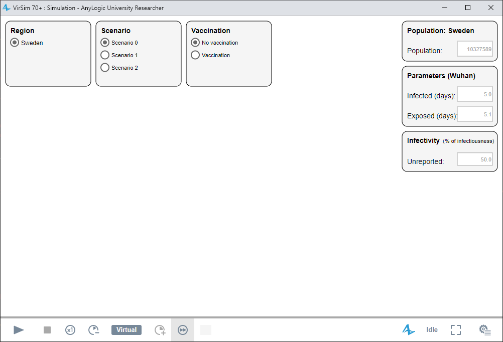
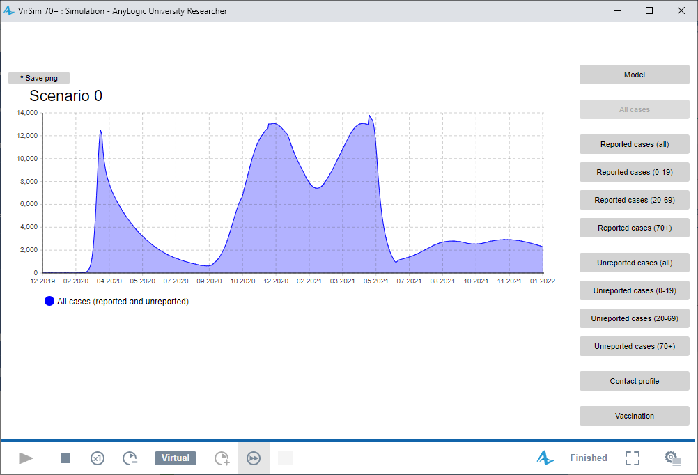
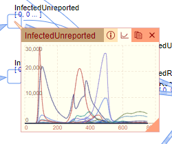

# VirSim
VirSim is a compartmental SEIR (Susceptible, Exposed, Infected, Recovered) model, divided into three age-groups 0-19, 20-69, and 70+. The model is developed to simulate three scenarios as part of regeringsuppdraget "Plan inför eventuella nya utbrott av covid-19".

The model is based on the model used in [Scenarier för fortsatt spridning – delrapport 6](https://www.folkhalsomyndigheten.se/publicerat-material/publikationsarkiv/s/scenarier-for-fortsatt-spridning-delrapport-6/). The uploaded model corrects a few bugs that was detected after publication.

## Requirements
VirSim is developed in the software [AnyLogic](https://www.anylogic.com/), and version 8.7.8 or later is required to run the model.

## Folder structure
The model "virsim-vaccine.alp" is found in the sub-folder "model", the number of reported cases per day and region are found in the sub-folder "data". The folder "figures" is used to store the figures used in this documentation. The folder "results/Figures" are used to store figures exported the model GUI.

## Model structure
The model consists of three parts:
* Main: is the simulation model and related functionality  
* Simulation: is used for starting the simulations  
* Optimization: is used to fit the model against reported cases in Sweden.

# Running the simulations
To run the simulations, click on the black triangle next to the green play button in the toolbar, and select "virsim-vaccine / Simulation". In the window that opens, choose a region and a scenario, and click on the gray play button in the lower-left of the window, see Figure 1 below.  

*Figure 1. The simulation GUI.*

## Exporting data
To export data, click on the "Model" button to open the model view area (Figure 2). Then click on the stock (compartment) or flow you want to export. In the pop-up window, click on the graph button and then on the copy button (Figure 3).

  
*Figure 2. The main model GUI.*  

  
*Figure 3. Export data*  

## Exporting figures
To export a graph, click on the "Save png" button above the graph (Figure 2)

# Running the optimizations
We have created an optimization experiment "Optimization" to estimate the infectivity, contact reduction, and proportion of unreported cases in each of the three age-groups (0-19, 20-69, and 70+).

To fit the model against the daily reported cases, click on the black triangle next to the green play button in the toolbar, then select virsim-vaccine / Optimization. In the window that opens, choose a optimization period, and click on the gray play button in the lower-left of the optimization window.

## Optimization requirements
The optimization uses requirements based on [prevalence](https://www.folkhalsomyndigheten.se/smittskydd-beredskap/utbrott/aktuella-utbrott/covid-19/statistik-och-analyser/undersokningar-och-datainsamlingar/forekomst-av-sjukdom/), [antibody](https://www.folkhalsomyndigheten.se/smittskydd-beredskap/utbrott/aktuella-utbrott/covid-19/statistik-och-analyser/undersokningar-och-datainsamlingar/genomgangen-infektion/), and [variant typing](https://www.folkhalsomyndigheten.se/smittskydd-beredskap/utbrott/aktuella-utbrott/covid-19/statistik-och-analyser/sars-cov-2-virusvarianter-av-sarskild-betydelse/) studies conducted in Sweden. A feasible solution to the optimization problem has to fulfill all of these requirements.

The requirements can be enabled or disabled by opening (double-clicking) on the optimization experiment (Optimization: Main) on the left side in the Projects view. Then, go to the "Properties" view to the left, and open the "Requirements" section.